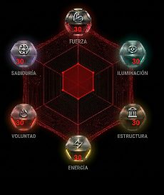

<div align="center">

# ⚔️ LifeRPG

**Tu progreso personal visual.**

[](https://kotlinlang.org/)
[](https://www.jetbrains.com/lp/compose-multiplatform/)
[]()

<br/>



</div>

---

## ¿Qué es LifeRPG?

Una app móvil multiplataforma (Android + iOS) que convierte tus hábitos y tareas del día a día en un sistema de puntos con 6 atributos. El progreso se refleja en un gráfico de radar hexagonal dibujado con Canvas de Compose.

Desarrollada en **Kotlin Multiplatform** con **Compose Multiplatform**. Sin backend, sin cuentas — todo se guarda en local.

---

## Características

### Gráfico de Radar
Hexágono dibujado nativamente con el Canvas de Compose usando trigonometría. Se anima al abrir la app y refleja en tiempo real los valores de cada atributo. Tiene gradiente radial de relleno, bordes estilizados e iconos posicionados en cada vértice.

### Misiones
Flujo de 3 pasos con Bottom Sheet:
1. Elegir **atributo** (grid 2x3 con icono y color por stat)
2. Elegir **actividad** (lista predefinida o escribir una custom)
3. Elegir **impacto** (Bajo 3pts · Medio 6pts · Alto 10pts)

Las misiones se completan con un long-press animado que da feedback háptico.

### Persistencia
`SharedPreferences` en Android, `NSUserDefaults` en iOS, a través de Multiplatform Settings. Los datos se serializan a JSON con `kotlinx-serialization`. Funciona 100% offline.

---

## Atributos

| Atributo | Ejemplos de actividades |
|:---|:---|
| 💪 **Fuerza** | Gym, Correr, Cardio, Yoga, Artes marciales |
| 📚 **Sabiduría** | Leer, Estudiar, Curso online, Podcast |
| ⚡ **Energía** | Dormir bien, Alimentación saludable, Hidratación |
| 🏗️ **Estructura** | Planificar el día, Cumplir rutina, Gestionar finanzas |
| 🧘 **Iluminación** | Meditación, Journaling, Contacto con naturaleza |
| 🔥 **Voluntad** | Resistir una tentación, Sin móvil X horas |

Cada atributo tiene su propio color y conjunto de actividades sugeridas en la app.

---

## Stack

| | Tecnología | Versión |
|:---|:---|:---|
| Lenguaje | [Kotlin](https://kotlinlang.org/) | 2.3.0 |
| UI | [Compose Multiplatform](https://www.jetbrains.com/lp/compose-multiplatform/) | 1.10.0 |
| Design System | Material 3 | 1.10.0-alpha05 |
| State | Jetpack ViewModel + Lifecycle | 2.9.6 |
| Persistencia | [Multiplatform Settings](https://github.com/russhwolf/multiplatform-settings) | 1.1.1 |
| Serialización | [kotlinx-serialization](https://github.com/Kotlin/kotlinx.serialization) | 1.6.3 |
| Build | Gradle (Kotlin DSL) | 8.14.3 |
| Android target | API 24+ (Android 7.0) | SDK 36 |

---

## Estructura

```
composeApp/src/commonMain/kotlin/org/example/liferpg/
├── App.kt                        # Entry point
├── AppScreen.kt                  # Scaffold, navegación, TopBar, BottomBar
├── Platform.kt                   # expect/actual multiplataforma
├── model/
│   └── StatTypes.kt              # Atributos, niveles de impacto, actividades
├── data/
│   ├── ProgresoDto.kt            # DTOs serializables
│   └── RepositorioProgreso.kt    # Capa de persistencia
└── ui/
    ├── MissionsScreen.kt         # Pantalla de misiones + wizard
    ├── MissionsViewModel.kt      # Estado reactivo de misiones
    ├── TaskRegistrationSheet.kt  # Bottom Sheet de registro
    └── components/
        └── RadarChart.kt         # Gráfico de radar (Canvas)
```

---

## Arquitectura

```
UI (Composables) → ViewModel → Repository → Multiplatform Settings (disco)
                                    ↕
                              DTOs + JSON (kotlinx-serialization)
```

- **UI**: Composables puros. El radar se dibuja directamente en Canvas. Navegación por tabs (HOME / TAREAS).
- **ViewModel**: `MisionesViewModel` con `mutableStateListOf`, auto-persiste cada cambio.
- **Data**: `RepositorioProgreso` abstrae el acceso a disco. Los DTOs van a JSON.
- **Model**: Enums de atributos, niveles de impacto, cálculo de puntos y actividades predefinidas.

---

## Cómo ejecutar

**Requisitos**: JDK 17+, Android Studio (Ladybug 2024.2+ recomendado), Xcode 15+ para iOS.

### Android
```bash
git clone https://github.com/omaradlcrrl/LifeRPG.git
cd LifeRPG
./gradlew :composeApp:installDebug
```
O abrir directamente en Android Studio y darle a Run.

### iOS
Desde Android Studio con el plugin de KMP, o abrir `iosApp/iosApp.xcodeproj` en Xcode.

---

## Roadmap

- [ ] Reseteo diario automático de misiones completadas
- [ ] Mejorar sistema de puntuación para hacerlo sostenible a largo plazo (topes diarios, decaimiento)
- [ ] Sistema de logros al alcanzar hitos
- [ ] Historial de progreso (gráficos semanales/mensuales)
- [ ] Notificaciones para misiones pendientes
- [ ] Perfil de usuario con nivel global
- [ ] Export/import del progreso
- [ ] Soporte Desktop (JVM)

---

## Autor

Desarrollado por **Omar**.
